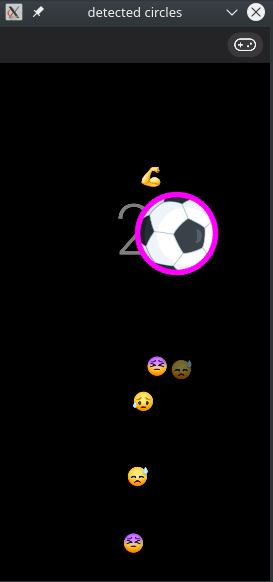

# scrcpy-opencv
[Scrcpy](https://github.com/Genymobile/scrcpy) is a tool that streams your android screen to your computer, and allows you to send mouse or keyboard input back to the android device.
This project modifies scrcpy to also send back automatically generated input by passing the frame on to the OpenCV computer vision library.
To see scrcpy-opencv in action, check out this [Youtube video](https://www.youtube.com/watch?v=4Ikzw7TttuU)!

# Run it yourself
Install [dependencies to build scrcpy](https://github.com/Genymobile/scrcpy/blob/master/BUILD.md):  
runtime dependencies  
`sudo apt install ffmpeg libsdl2-2.0-0 adb`  
client build dependencies  
`sudo apt install gcc git pkg-config meson ninja-build libavcodec-dev libavformat-dev libavutil-dev libsdl2-dev`  
server build dependencies  
`sudo apt install openjdk-8-jdk`  

Clone this repository:  
`git clone https://github.com/RobbertH/scrcpy-opencv.git`  
Go into the folder you just cloned:  
`cd scrcpy-opencv`  
Save the directory of the prebuilt server in an environment variable, we'll need this later:  
`PREBUILT_SERVER_PATH=$PWD/prebuilt`  
Change directory to the desktop part of the project, called `scrcpy`,  
`cd scrcpy`  
then run the following command, making sure $PREBUILT_SERVER_PATH contains the prebuilt scrcpy server:    
`meson x --buildtype release --strip -Db_lto=true -Dprebuilt_server=$PREBUILT_SERVER_PATH/scrcpy-server-v1.12.1`  
to configure the build, and then  
`ninja -Cx`  
to build the application, so you can finally  
`./run x`  
to run the modified scrcpy.

Also make sure your android phone is plugged in over USB and has `adb` enabled.

# Background and context
I wanted to win a soccer game on android, where you have to tap a ball to keep it in the air.
To do so, the 'AVFrame' used in scrcpy is converted to an OpenCV 'mat' so that OpenCV's image processing functions can be run on it.
Then, a circle the size of the football is extracted, using "HoughCircles".
Lastly, an input tap is sent back to the android device, in the center of that circle.

The main modifications to scrcpy include:
* Modifying the meson config files to compile both scrcpy (C) and the additional functions (C++) that depend on OpenCV (C++).
* Converting the scrcpy image format to one that OpenCV can understand.
* Writing the additional functions to use OpenCV and send input to the android device.

Since most work done was part of "making it work" rather than writing the actual code, I figured this might help other people in achieving similar goals.
The concrete case of the soccer game is just one example of what can be achieved with this powerful tool:
any OpenCV function can be run to produce input to the android device, based on the frames.

If you want to read more, there is a [blog post](https://robberthofman.com/projects/2020/03/30/hacking-scrcpy-to-win-fb-soccer-game/).

